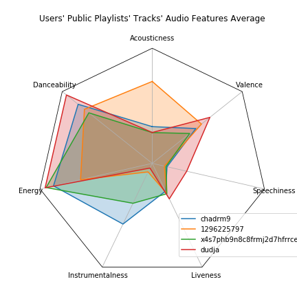

Polka
=====
This project makes use of `Spotipy <https://github.com/plamere/spotipy>`_, a light-weight 
Python client for the `Spotify Web API <https://developer.spotify.com/documentation/web-api/>`_.

Polka can retrieve and store spotify user data (e.g. track audio features) as `NumPy <https://numpy.org/>`_
matricies for use with `SciPy <https://www.scipy.org/>`_ and `Scikit-learn <https://scikit-learn.org/stable/index.html>`_.

`Pandas <https://pandas.pydata.org/>`_ cannot readily create spider/radar charts for multidimensional data
so I have implemented `this matplotlib demo <https://matplotlib.org/gallery/specialty_plots/radar_chart.html>`_
to chart mean `audio features <https://developer.spotify.com/documentation/web-api/reference/tracks/get-several-audio-features/>`_ for multiple users.

I have begun collecting my personal Discover Weekly and Release Radar playlist tracks to eventually train and test
different data `classifiers <https://scikit-learn.org/stable/auto_examples/classification/plot_classifier_comparison.html>`_.

***** *This document will be updated as analysis progresses and development continues. (2019-08-26)*

Sample chart
------------

Mean track `audio features <https://developer.spotify.com/documentation/web-api/reference/tracks/get-several-audio-features/>`_
(excluding loudness and tempo) for 4 users in `Jupyter <https://jupyter.org/>`_ notebook:

Examples
--------

* Copy a playlist

	#. Create a Spotipy instance with an
	   `authorization token <https://spotipy.readthedocs.io/en/latest/#authorization-code-flow>`_
	   for privileged access. Write access is neccessary to create a new playlist. ::

		sp = core.do_auth(username)

	#. Call copy_playlist(). This function returns a Spotify snapshot reference. ::

		ss = core.copy_playlist(sp, username, source_playlist_name, destination_playlist_name, owner)

* Fetch all public playlists' tracks' audio features for list of users:

	#. Create a Spotipy instance with only
	   `client credentials <https://spotipy.readthedocs.io/en/latest/#client-credentials-flow>`_
	   for public user playlist access::

		sp = core.do_auth()

	#. Call fetch_user_list(). This function returns a list of User objects ::

		list = core.fetch_user_list(sp, list_path, npz_dir)

Notes
-----

#. Original `project structure <https://www.kennethreitz.org/essays/repository-structure-and-python>`_
   was referenced from `navdeep-G/samplemod <https://github.com/navdeep-G/samplemod>`_ and now uses 
   `pipenv <https://github.com/pypa/pipenv>`_.

#. The project's Research folder contains these notebooks (thus far):

	* radar_sample.ipynb
		Fetch or load public track data then uses numpy to calculate and plot mean audio features for list of users.

	* accum_weekly.ipynb
		Data collection for future classifer training and testing. It is used to make private copies of Discover Weekly or Release Radar playlists.

#. Each User object contains 18 aspects in 3 homogeneous numpy arrays to comprise the total
   `audio feature set <https://developer.spotify.com/documentation/web-api/reference/tracks/get-several-audio-features/>`_ for each
   track, separated by dtype. ::

	np_af_int (int64)[4]
		duration_ms
		key
		mode
		time_signature
		
	np_af_flt (float64)[9]
		acousticness
		danceability
		energy
		instrumentalness
		liveness
		loudness
		speechiness
		tempo
		valence

	np_af_str (U64)[5]
		analysis_url
		id
		track_href
		type
		uri

   These are `saved <https://docs.scipy.org/doc/numpy/reference/generated/numpy.savez.html>`_
   to and `loaded <https://docs.scipy.org/doc/numpy/reference/generated/numpy.load.html>`_
   from disk as a single, uncompressed .npz file which contains them as 3 variables in .npy format.

#. Spotipy's `SpotifyClientCredentials <https://spotipy.readthedocs.io/en/latest/#client-credentials-flow>`_
   class is suitable for accessing public playlists by username and uses these environment variables:

	* CLIENT_ID

	* CLIENT_SECRET

	* REDIRECT_URI

#. User account authorization for granular access is tokenized with the following 
   `scopes <https://developer.spotify.com/documentation/general/guides/scopes/>`_:

	* playlist-read-collaborative
		Include collaborative playlists when requesting a user's playlists.

	* playlist-modify-public
		Write access to a user's public playlists.

	* playlist-modify-private
		Write access to a user's private playlists.

	* playlist-read-private
		Read access to user's private playlists.

Further reading
---------------
`Spotipy Docs <https://spotipy.readthedocs.io/en/latest/>`_

`Spotify Docs <https://developer.spotify.com/documentation/web-api/>`_

`SciPy Stack <https://www.scipy.org/docs.html>`_

`NumPy Manual <https://www.numpy.org/devdocs/>`_

`Pipenv Docs <https://docs.pipenv.org/en/latest/>`_

`Repository Structure and Python <https://www.kennethreitz.org/essays/repository-structure-and-python>`_

`Project Jupyter Docs <https://jupyter.org/documentation>`_

`Matplotlib Radar/Spider/Star Chart <https://matplotlib.org/gallery/specialty_plots/radar_chart.html>`_

`Scikit-learn Supervised Learning <https://scikit-learn.org/stable/auto_examples/classification/plot_classifier_comparison.html>`_